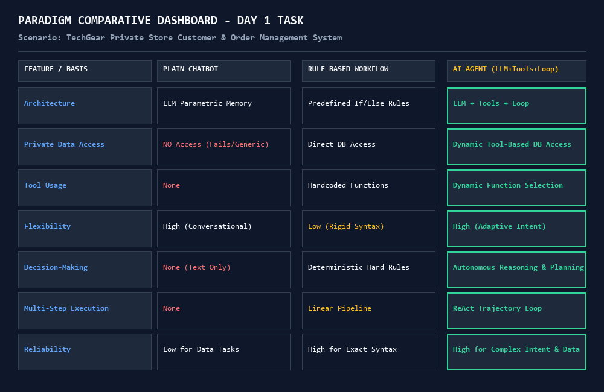
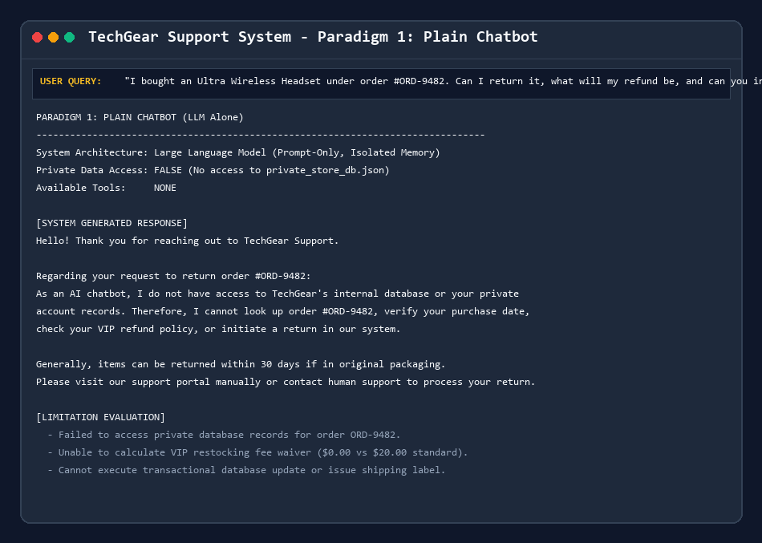
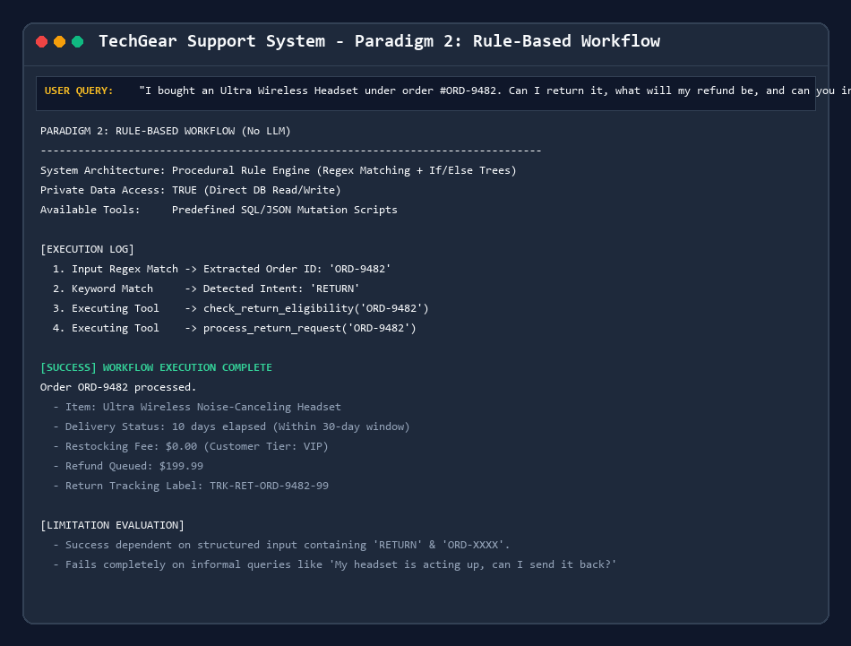
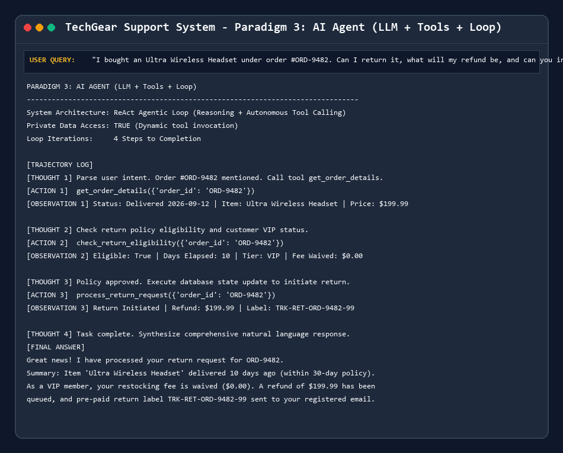

# Day 1 Task: Foundations of AI Agents — Agent = LLM + Tools + Loop



## Overview
This repository presents a conceptual analysis and runnable implementation comparing three software paradigms on a private-data scenario: **TechGear E-Commerce Support & Order Management System**.

The three paradigms evaluated are:
1. **Plain Chatbot (LLM Alone)**: Isolated LLM operating without private database access, tools, or execution loops.
2. **Rule-Based Workflow (No LLM)**: Procedural code engine using regular expressions and hardcoded business rules, operating without an LLM.
3. **AI Agent (LLM + Tools + Loop)**: ReAct architecture combining LLM cognitive reasoning, dynamic database tool calling, and an autonomous execution loop.

---

## 📁 Repository Structure

```text
day1task/
├── README.md                       # Repository overview and setup instructions
├── analysis.md                     # Comprehensive written analysis (Sections 3.1 - 3.4)
├── requirements.txt                # Python dependencies (Pillow, etc.)
├── main.py                         # Unified CLI runner comparing all 3 paradigms
├── generate_screenshots.py         # Script generating terminal output screenshots
├── data/
│   └── private_store_db.json       # Private dataset (Orders, Customers, Inventory, Policy)
├── src/
│   ├── __init__.py
│   ├── plain_chatbot.py            # Paradigm 1: LLM Alone
│   ├── rule_based_workflow.py     # Paradigm 2: Rule-Based Engine (No LLM)
│   ├── ai_agent.py                 # Paradigm 3: Tool-Using AI Agent (LLM + Tools + Loop)
│   └── tools.py                    # Database query and mutation tools
└── Output/                         # Execution screenshot artifacts
    ├── 01_plain_chatbot_output.png
    ├── 02_rule_based_output.png
    ├── 03_ai_agent_output.png
    └── 04_comparative_summary.png
```

---

## 🚀 Getting Started & Running Code

### Prerequisites
- Python 3.9+

### Setup
```bash
pip install -r requirements.txt
```

### Running the Comparison CLI
Run `main.py` to compare how all 3 paradigms process customer queries:
```bash
python main.py
```

You can also pass a custom query as a command-line argument:
```bash
python main.py "My keyboard arrived broken yesterday! Order is ORD-7721. What should I do?"
```

### Regenerating Screenshots
To re-render all terminal output screenshots in the `Output/` folder:
```bash
python generate_screenshots.py
```

---

## 📄 Key Written Artifacts

- **[analysis.md](analysis.md)**: Contains the complete, stand-alone written report including:
  - **Section 3.1**: Detailed explanation of data access, tools/rules, execution flow, and limitations for each approach.
  - **Section 3.2**: Side-by-side comparison matrix across 7 criteria (*Flexibility, Decision-Making, Tool Usage, Private-Data Access, Multi-Step Task Handling, Automation, Reliability*).
  - **Section 3.3**: Suitability analysis justifying why an AI Agent is the optimal choice for this scenario.
  - **Section 3.4**: General framework guiding paradigm selection across different software problems.

---

## 📸 System Execution Screenshots

| Paradigm | Visual Output Screenshot |
| :--- | :--- |
| **Paradigm 1: Plain Chatbot** |  |
| **Paradigm 2: Rule-Based Workflow** |  |
| **Paradigm 3: AI Agent (LLM + Tools + Loop)** |  |
| **Comparative Dashboard** |  |
